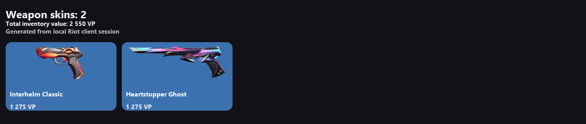
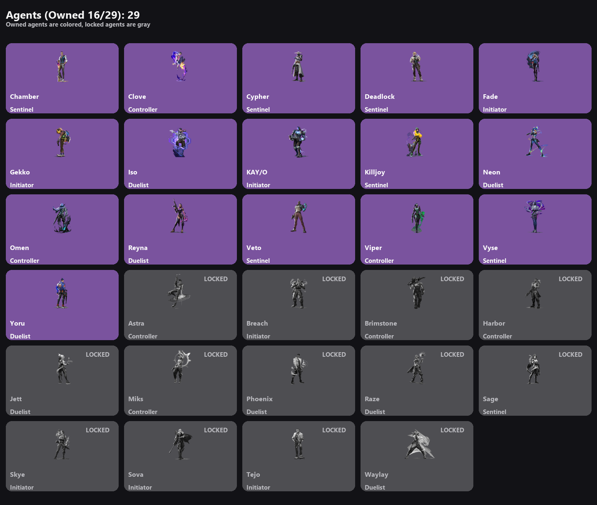
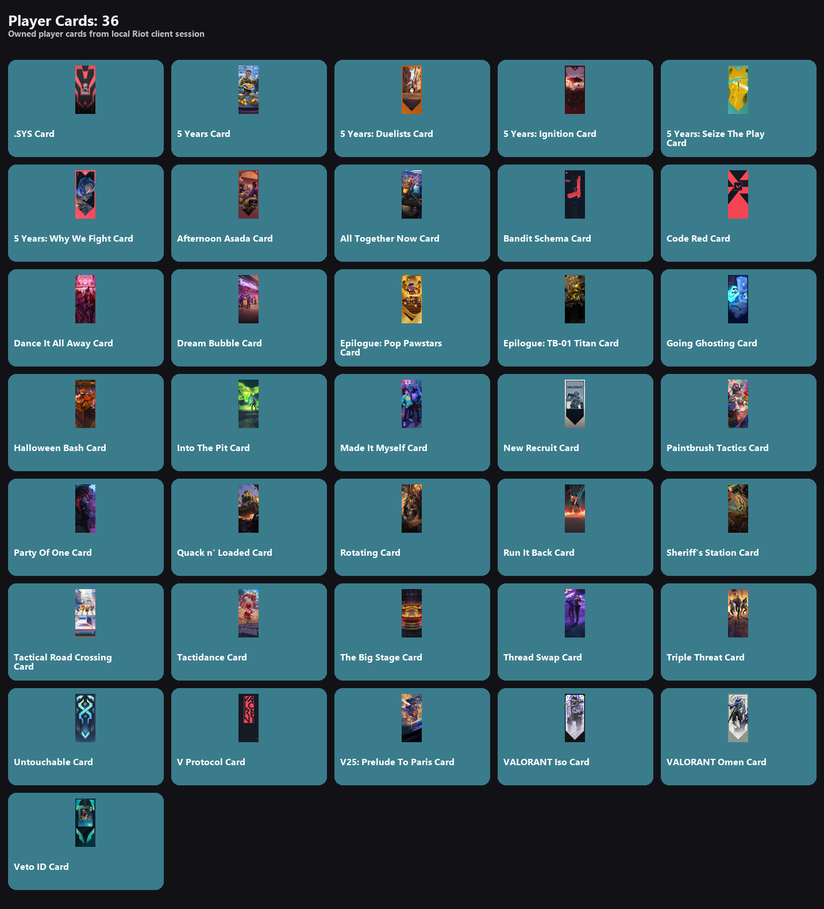
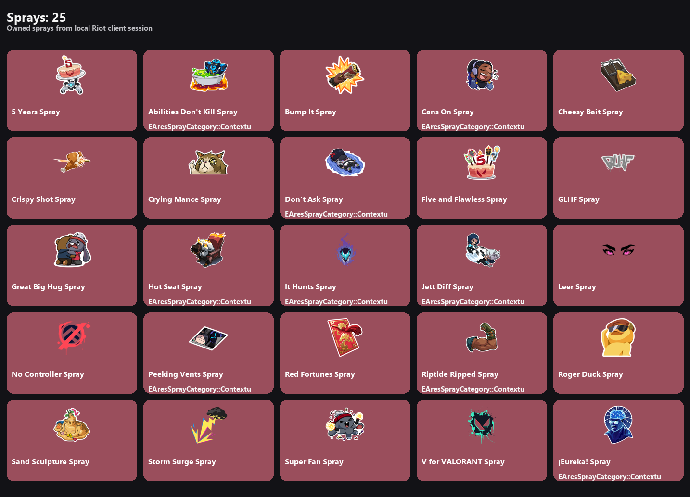
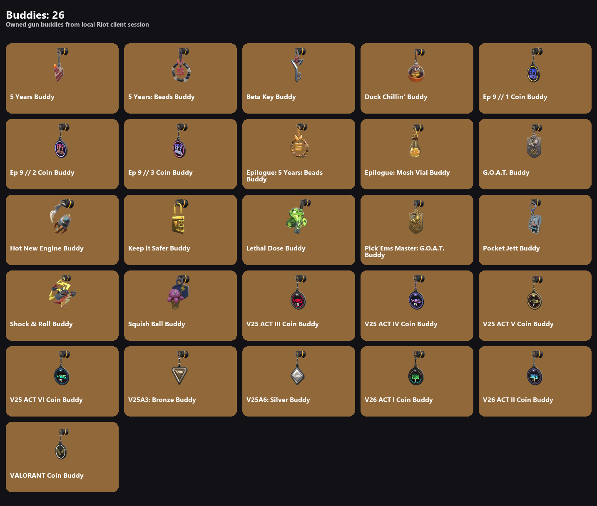
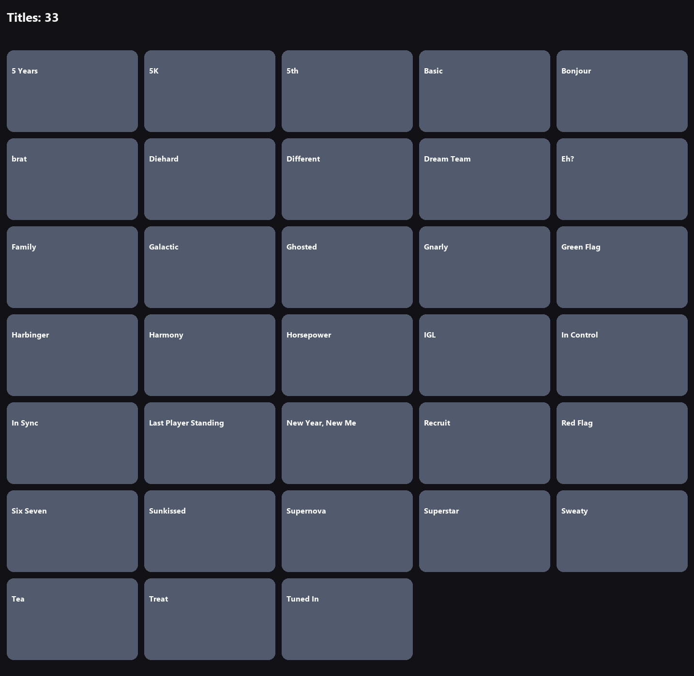

# Valorant Local Inventory Exporter

Generate local Valorant inventory images from an authenticated Riot Client session.

This script reads your local Riot Client lockfile, gets session tokens, fetches owned entitlements, matches them against the public Valorant content catalog, and renders inventory grids.

## Features

- Owned weapon skins image (`inventory.png`) with rarity colors and total value
- Agents image (`agents.png`) with all agents shown:
  - owned agents are colored
  - locked agents are gray
- Owned player cards (`player_cards.png`)
- Owned sprays (`sprays.png`)
- Owned buddies (`buddies.png`)
- Owned titles (`titles.png`)

## Requirements

- Windows 10/11
- Riot Client + VALORANT installed
- Logged into Riot account
- VALORANT launched to menu
- Python 3.10+

## Installation

```bash
python -m venv .venv
.venv\Scripts\activate
pip install -r requirements.txt
```

## Usage

```bash
python val.py
```

Generated files are saved in the same folder as `val.py`.

## Output Files

- `inventory.png`
- `agents.png`
- `player_cards.png`
- `sprays.png`
- `buddies.png`
- `titles.png`

## Screenshots

### Skins Inventory


### Agents


### Player Cards


### Sprays


### Buddies


### Titles


## Security and Privacy

- No Riot username/password is stored.
- Access and entitlement tokens are taken from local Riot Client session.
- Do not publish logs or debug output containing IDs/tokens.
- Generated inventory images may reveal account progression and owned content.

## Legal Notice

This project uses unofficial/local Riot API endpoints. Endpoint behavior can change at any time and may differ by region/patch. Use at your own risk and follow Riot Terms of Service.

## Known Limitations

- Some store price endpoints may be unavailable in certain regions/sessions.
- When live offers are unavailable, skin prices are estimated by tier.
- Depends on Riot Client being active and authenticated.

## Disclaimer

This is an unofficial community tool and is not affiliated with Riot Games.
